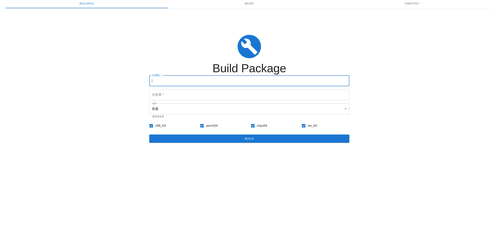

# iso_server
## 前端模块
### 说明
前端模块在项目中web目录内
#### 框架
整体项目框架用的是next.js

代码逻辑主要使用react

ui框架使用的是基于react的mui

整体项目使用的项目管理器（包管理）为yarn

PS：这里记录个坑，自构建的项目尤其设计到mui和react相关npm提供的lock文件根本锁不住版本号，新环境安装依赖的时候各种版本依赖乱跳，

所以这里框架用了稳定的next.js并且配合yarn来管理整个项目。

#### 页面预览



#### 代码说明
入口是pages里面的index.js
内容页面在src目录中
+ App.jsx页面为入口，返回一个Tabbar控件
+ Tabbar.jsx文件为应用上方tab切换控件的代码，主要实现Mkiso，Owntest和Buildpkg三个页面的切换
+ Mkiso.jsx页面：
    + 接收： 
        + git地址
        + 分支名称
        + 目标架构
    + 交互
        + 发送数据给后端
        + 接收后端状态值
    + 逻辑
        + 判断后端返回值来提示任务是否发送成功
+ Owntest.jsx页面：
    + 接收： 
        + 目标机器ip
        + 目标测试模式（reboot，ltp）
    + 交互
        + 发送数据给后端
        + 接收后端状态值
    + 逻辑
        + 判断后端返回值来提示任务是否发送成功
+ Buildpkg.jsx页面：
    + 接收： 
        + git地址
        + 分支名称
        + 目标架构（future）
        + 仓库（future）
    + 交互
        + 发送数据给后端
        + 接收后端状态值
    + 逻辑
        + 判断后端返回值来提示任务是否发送成功

### 运行方法
运行：
```
cd web
yarn install
yarn dev
```

## 后端模块（nodejs版）
### 说明
主要实现一个服务器启动在8000端口，接口说明
+ buildpkg
    + 接收参数
        + git_url
        + branch_name
        + repo （future）
        + arch （future）
    + 交互
        + 根据传值状态给前端返回状态值
        + 调用对应脚本执行任务
    + 逻辑
        + 判断接收值是否为空
        + 拼接参数值作为对应脚本参数执行
        + 判断脚本返回值（future）
+ owntest
    + 接收参数
        + ip_address
        + test_name
    + 交互
        + 根据传值状态给前端返回状态值
        + 调用对应脚本执行任务
    + 逻辑
        + 判断接收值是否为空
        + 拼接参数值作为对应脚本参数执行
        + 判断脚本返回值（future）
+ mkiso
    + 接收参数
        + git_url
        + branch_name
        + arch （x86_64 , arm64 , mips64 , sw_64 , all）
    + 交互
        + 根据传值状态给前端返回状态值
        + 调用对应脚本执行任务
    + 逻辑
        + 判断接收值是否为空
        + 拼接参数值作为对应脚本参数执行
        + 判断脚本返回值（future）

### 运行方法
运行：
```
cd nodejs-server
npm install
npm start
```


## 脚本模块
### 软件包构建
#### 概要
+ 配置文件  --- build_pkg.conf
+ 入口程序  --- main.sh (future)
+ 主操作程序  --- build_pkg.sh

调用的是Bbuilder，需要在对应服务器上预先配置完成

#### 单独使用说明
执行：`bash build_pkg.sh git地址  git分支`

### 镜像构建

#### 概要
+ 配置文件  --- mkiso.conf
+ 入口程序  --- main.sh
+ 主操作程序  --- run_mkiso.sh

常规单独架构执行时配置文件中变量branch_name和变量swbranch_name至少需要有一个被赋值
全平台构建是配置文件中变量branch_name和变量swbranch_name全部需要被赋值

#### 单独使用说明
执行：`bash main.sh 架构`
架构包含： x86_64 , arm64 , mips64 , sw_64 , all


### 自测脚本
#### 概要
+ 配置文件  --- owntest.conf
+ 入口程序  --- main-send_scripts.sh 
+ 客户端配置脚本  --- do_owntest_conf.sh
+ 自动执行重启脚本  --- do_owntest_reboot.sh
+ 自动执行sts脚本  --- do_owntest_sts.sh
+ 自动执行ltp脚本  --- do_owntest_ltp.sh

#### 单独使用说明
1. 填写配置文件
2. 在服务端执行`bash main-send_scripts.sh ip地址`(在配置文件里设置过ip则可以不带参数直接执行)
    此脚本会将配置及其他脚本发送到客户端
3. 登录客户端执行所需测试脚本即可